# Architecture

One idea holds this together: **the model reads, the code decides.**

```mermaid
flowchart TB
    subgraph input[" "]
        A["Call for proposals<br/><i>raw rules text</i>"]
        B["Organisation profile<br/><i>country, legal form, can it travel,<br/>can it front money, headcount</i>"]
    end

    A --> C

    subgraph model["MODEL LAYER — reads, never decides"]
        C["Strands Agent<br/><code>clausewitz/agent.py</code>"]
        C -->|"tool call per demand"| D["Requirement<br/>kind + <b>quote</b> + value"]
    end

    D --> E

    subgraph gate["THE GATE — where hallucination dies"]
        E{"quote_is_grounded<br/><i>does this sentence appear<br/>verbatim in the source?</i>"}
    end

    E -->|"no"| F["dropped → <b>unverified</b>"]
    E -->|"yes, but unknown kind"| G["surfaced → <b>unsupported rule</b>"]
    E -->|"yes"| H

    subgraph det["DECISION LAYER — deterministic, no model, no network"]
        H["screening.py<br/><i>one pure function per rule</i>"]
        B --> H
    end

    H --> I{"any rule<br/>excludes?"}
    I -->|"yes"| J["<b>EXCLUDED</b><br/>+ the clause that did it"]
    I -->|"no, and nothing unresolved"| K["<b>ELIGIBLE</b>"]
    F --> L
    G --> L
    I -->|"no, but something unresolved"| L["<b>UNDECIDABLE</b><br/><i>a human should look</i>"]

    J --> M["report.py<br/><i>three buckets, every exclusion quoted</i>"]
    K --> M
    L --> M

    style E fill:#4c1d95,stroke:#a78bfa,color:#fff
    style gate fill:#1e1b4b,stroke:#6366f1
    style det fill:#052e16,stroke:#22c55e
    style model fill:#431407,stroke:#f97316
    style J fill:#7f1d1d,stroke:#ef4444,color:#fff
    style K fill:#14532d,stroke:#22c55e,color:#fff
    style L fill:#78350f,stroke:#f59e0b,color:#fff
```



## Why the split

A language model is genuinely good at finding the sentence about who may enter,
buried on page four between the sponsor logos and the schedule. It is genuinely
bad at being trusted with the answer, because **when it is wrong it is wrong
fluently.**

So it is given the reading and denied the verdict.

## What actually enforces it

Not the prompt. Prompts are requests. The enforcement is
`quote_is_grounded()`: every requirement the model reports must quote text that
appears **verbatim** in the source, after folding only the differences that are
not differences — curly quotes, line wrapping, non-breaking spaces.

A requirement the model invented quotes nothing that exists. It fails the check
and is dropped. **A hallucination cannot become a rejection. At worst it becomes
a missing data point, which pushes the call towards a human.**

This is testable without a model, a network or a credential — and it is, 46
times over.

## The three buckets

Most screeners have two. The third is the design decision.

| Bucket | Means | Why it exists |
|---|---|---|
| **ELIGIBLE** | every extracted rule passed | — |
| **EXCLUDED** | a rule blocked, **and here is the sentence** | a filter that will not show its reasoning is indistinguishable from a broken one |
| **UNDECIDABLE** | something could not be read, resolved or understood | collapsing this into yes or no is the lie that makes these tools useless for deciding anything |

A call that says nothing about eligibility is **not** a call that admits
everyone. It is a call that has to be read by a person, and the output says so.

## Failure direction

Every ambiguity resolves towards **UNDECIDABLE**, never towards EXCLUDED:

- quote not found in source → undecidable
- rule kind this screener has no check for → undecidable
- a place named that cannot be resolved to a country code → undecidable
- nothing extracted at all → undecidable

**Wrongly telling someone not to apply costs them a grant. Wrongly asking a
human to look costs them a minute.** The asymmetry is deliberate and it is
tested.

## Layout

```
clausewitz/
  agent.py       Strands agent. Reads, quotes, reports. Never decides.
  screening.py   The rules. Pure functions. No model, no network, no deps.
  normalise.py   Turning what a call says into what a check can compare.
  report.py      Three buckets, every exclusion carrying its clause.
  cli.py         python -m clausewitz  ·  --audit  ·  --json  ·  --read
fixtures/
  calls.json     Real calls, real wording, so every quote is traceable.
tests/           67 tests. None needs a model, a network or a credential.
```

## Running it

```bash
python -m clausewitz                # the demo, no credentials
python -m clausewitz --audit        # prove every quote is verbatim
python -m unittest discover -s tests -p "test_*.py"
```

Only reading a *new* call with the model needs an API key. The screening layer
never does — which is the point, and why a judge can reproduce the guarantee
without putting a card down.
